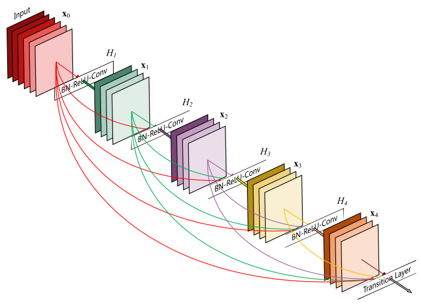

# Overview 

This is an Image Classifier that follows the Residual Network architecture with 50 layers that can be used to predict digits in sign language(0-5).

In recent years, neural networks have become deeper, with state-of-the-art networks going from just a few layers (e.g., AlexNet) to over a hundred layers.

The main benefit of a very deep network is that it can represent very complex functions. It can also learn features at many different levels of abstraction, from edges (at the lower layers) to very complex features (at the deeper layers). However, using a deeper network doesn't always help. A huge barrier to training them is vanishing gradients: very deep networks often have a gradient signal that goes to zero quickly, thus making gradient descent unbearably slow. 

In ResNets, a "shortcut" or a "skip connection" allows the gradient to be directly backpropagated to earlier layers:

The "identity block" is the standard block used in ResNets, and corresponds to the case where the input activation (say a[l]) has the same dimension as the output activation (say a[l+2]):

Next, the ResNet "convolutional block" is the other type of block. You can use this type of block when the input and output dimensions don't match up. The difference here is that there is a CONV2D layer in the shortcut path:

The detailed structure of this ResNet-50 model:

## Dataset

The SIGNS dataset contains images of digits 0-5 in sign language

## Getting Started

In order to train the model and make predictions, you will need to install the required python packages:

`pip install -r requirements.txt`

Now you can either open up a terminal and start training the model:

`python train.py`

Or directly run the prediction script which will load the pretrained model:

`python predict.py`

Now you are all set up!

## Results 

Training:

`number of training examples = 1080`
`X_train shape: (1080, 64, 64, 3)`
`Y_train shape: (1080, 6)`

`Epoch 20/20`
`1080/1080 [==============================] - 63s 59ms/step - loss: 0.0219 - acc: 0.9944`
`Loss = 0.0219`
`Train Accuracy = 99.44% (0.9944)`

Testing:

`number of test examples = 120`
`X_test shape: (120, 64, 64, 3)`
`Y_test shape: (120, 6)`

`120/120 [==============================] - 2s 18ms/step`
`Loss = 0.1936`
`Test Accuracy = 94.99% (0.9499)`

Model Parameters:

`Total params: 23,600,006`
`Trainable params: 23,546,886`
`Non-trainable params: 53,120`

## Built With

* Python
* Keras
* TensorFlow
* NumPy

## Authors

Prabhsimran Singh

## License

This project is licensed under the MIT License - see the LICENSE.md file for details